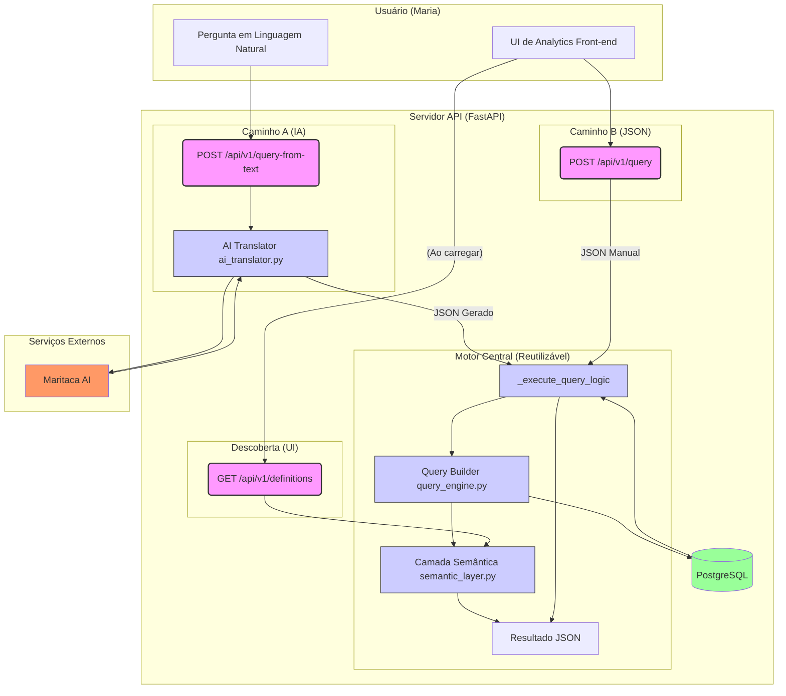

# Analytics QueryBuilder (Plataforma Completa)

Este projeto é uma plataforma completa de analytics, construída para resolver um problema central: donos de negócio, como a "Maria", estão "ricos em dados, mas pobres em insights".

### A Dor da "Maria"

Maria é dona de 3 restaurantes em São Paulo. Ela vende por 5 canais (iFood, Rappi, balcão, etc.), tem 200+ produtos e processa 1.500 pedidos por semana. Ela tem todos os dados, mas não consegue tomar decisões.

Hoje, ela não consegue responder perguntas simples de negócio:

  * *"Qual produto vende mais na quinta à noite no iFood?"*
  * *"Meu ticket médio está caindo. É por canal ou por loja?"*
  * *"Quais clientes compraram 3+ vezes mas não voltam há 30 dias?"*

Dashboards fixos não ajudam, e ferramentas de BI são complexas demais. Ela precisa de poder de exploração sem a complexidade técnica.

### A Nossa Solução

Esta plataforma devolve o poder de exploração à Maria através de duas peças centrais que trabalham juntas:

1.  **Um "Motor" de Alta Performance (Back-end):** Uma API robusta em **FastAPI** que atua como o cérebro. Ela possui um `Query Builder` que traduz JSON em SQL otimizado e um `AI Translator` que entende perguntas em português.
2.  **Uma "Cabine de Comando" Intuitiva (Front-end):** Uma interface limpa em **React** que atua como o volante. Ela permite que a Maria construa queries visualmente, adicione filtros e, o mais importante, "pergunte" o que quer saber em uma barra de busca.


## 🏛️ Arquitetura e Componentes do Projeto

O sistema é dividido em dois módulos principais. O diagrama abaixo mostra como eles se comunicam:



### 📁 1. O Motor (back-query-builder/)

O backend em FastAPI é responsável por toda a lógica de negócios, segurança e performance. Ele traduz os "pedidos" (JSON ou texto) em SQL otimizado e seguro. Suas features principais incluem:

  * **Motor de Query (Query Builder):** Traduz um JSON de negócios (ex: `"metrics": ["ticket_medio"]`) em SQL otimizado, gerenciando JOINs e agrupamentos automaticamente.
  * **Tradutor de IA (NLP):** Usa a Maritaca AI para traduzir perguntas em linguagem natural (ex: "top 5 produtos no delivery") diretamente no formato JSON que o Query Builder entende.
  * **"AI Guardrail" (Segurança):** A IA nunca gera SQL. Ela gera um JSON que é *validado* rigorosamente por schemas Pydantic, prevenindo injeção de prompt e "alucinações" de query.
  * **Alta Performance (Async):** Construído com FastAPI e `asyncpg`, garante que as queries sejam executadas abaixo do RNF de 500ms (com os índices corretos).
  * **Segurança:** 100% seguro contra SQL Injection (via parametrização) e proteção contra DoS com validação de limites de query.

**➡️ [Leia a documentação completa do Back-end aqui](./back-query-builder/README.md)**

### 📁 2. A Interface (front-query-builder/)

O frontend em React é a interface de usuário que consome a API. É onde o usuário constrói queries, aplica filtros e visualiza gráficos. Suas features principais incluem:

  * **Construtor Visual:** Permite ao usuário selecionar múltiplas métricas e dimensões em menus suspensos, que são preenchidos dinamicamente pela API.
  * **Barra de IA ("Pergunte"):** Permite que a "Maria" faça perguntas em linguagem natural, que são enviadas diretamente para o endpoint `/query-from-text`.
  * **Filtragem Avançada:** Uma UI modal para adicionar múltiplos filtros complexos (`=`, `!=`, `LIKE`, etc.) antes de rodar a consulta.
  * **Visualização Dinâmica:** Renderiza os resultados em múltiplos formatos (Barra, Linha, Pizza, Tabela) usando `recharts`.
  * **Estado Global:** Usa `Zustand` para gerenciar o estado da query (métricas, filtros, etc.) e dos resultados, mantendo toda a UI sincronizada.

**➡️ [Leia a documentação completa do Front-end aqui](./front-query-builder/README.md)**


## 🚀 Começando (Como Rodar o Projeto)

Você pode rodar o projeto de duas formas: com Docker (recomendado para uma execução simples) ou rodando cada módulo isoladamente (ideal para desenvolvimento).

### Pré-requisitos

  * Docker e Docker Compose
  * Node.js 18+ (para rodar isolado)
  * Python 3.10+ (para rodar isolado)

### ⚠️ Ação Obrigatória: Otimizar o Banco de Dados

Para que a API atenda ao RNF de \< 500ms, você **deve** criar os índices no banco de dados. Este passo é necessário **antes de rodar a aplicação pela primeira vez** (seja com Docker ou isoladamente).

Conecte-se ao PostgreSQL do projeto e execute o script de otimização abaixo:

```sql
-- Otimiza filtros de data
CREATE INDEX IF NOT EXISTS idx_sales_created_at ON sales(created_at);

-- Otimiza JOINS e filtros de canal
CREATE INDEX IF NOT EXISTS idx_sales_channel_id ON sales(channel_id);
CREATE INDEX IF NOT EXISTS idx_channels_name ON channels(name);

-- Otimiza JOINS de produtos
CREATE INDEX IF NOT EXISTS idx_product_sales_sale_id ON product_sales(sale_id);
CREATE INDEX IF NOT EXISTS idx_product_sales_product_id ON product_sales(product_id);

-- Índices bônus
CREATE INDEX IF NOT EXISTS idx_sales_store_id ON sales(store_id);
CREATE INDEX IF NOT EXISTS idx_products_name ON products(name);
```

### Opção 1: Rodando com Docker (Recomendado)

Esta é a forma mais simples de subir toda a stack (Front e Back).

1.  **Clone o repositório:**

    ```bash
    git clone https://github.com/iaZe/query-builder.git
    cd query-builder
    ```

2.  **Configure as Variáveis de Ambiente:**

      * Crie o arquivo `.env` dentro da pasta `back-query-builder/`.
      * Crie o arquivo `.env` dentro da pasta `front-query-builder/`.
      * *Veja a seção "Configuração" abaixo para saber quais chaves preencher.*

3.  **Suba os serviços:**

    ```bash
    docker compose up -d
    ```

    (Após subir, **não se esqueça de executar o script de otimização do banco** acima.)

Isso irá construir e iniciar:

  * **Back-end (API):** `http://localhost:8000`
  * **Front-end (UI):** `http://localhost:5173`
  * **Banco de Dados (PostgreSQL):** Porta `5432`

### Opção 2: Rodando os Módulos Isoladamente (Para Desenvolvimento)

Siga estes passos se quiser rodar o back-end e o front-end em terminais separados.

#### 1\. Rodando o Back-end (Terminal 1)

1.  Navegue até a pasta do back-end:
    ```bash
    cd back-query-builder
    ```
2.  Crie e ative um ambiente virtual:
    ```bash
    python3 -m venv venv
    source venv/bin/activate # ou .\venv\Scripts\activate no Windows
    ```
3.  Instale as dependências:
    ```bash
    pip install -r requirements.txt
    ```
4.  Crie o arquivo `.env` (veja a seção de Configuração).
5.  **Execute o script de otimização do banco** (mostrado na seção "Ação Obrigatória") no seu PostgreSQL.
6.  Inicie o servidor FastAPI:
    ```bash
    uvicorn app.main:app --host 0.0.0.0 --port 8000
    ```
    *API disponível em `http://localhost:8000`*

#### 2\. Rodando o Front-end (Terminal 2)

1.  Navegue até a pasta do front-end:
    ```bash
    cd front-query-builder
    ```
2.  Instale as dependências:
    ```bash
    npm install
    ```
3.  Crie o arquivo `.env` (veja a seção de Configuração).
4.  Inicie o servidor de desenvolvimento:
    ```bash
    npm run dev
    ```
    *UI disponível em `http://localhost:5173`*


## ⚙️ Configuração (Variáveis de Ambiente)

Você precisará criar arquivos `.env` em cada módulo.

### 1\. Back-end

**Arquivo:** `/back-query-builder/.env`

```ini
# Configuração do Banco de Dados PostgreSQL
DB_HOST=localhost
DB_PORT=5432
DB_USER=postgres
DB_PASSWORD=sua_senha_aqui
DB_NAME=analytics_db

# Configuração da Aplicação
APP_ENV=development

# Configuração da Maritaca AI
MARITACA_API_KEY=sua_chave_aqui
```

### 2\. Front-end

**Arquivo:** `/front-query-builder/.env`

```ini
# URL da API do back-end
VITE_API_BASE_URL=http://localhost:8000
```


## 🧪 Rodando os Testes (Back-end)

O back-end possui 3 suítes de teste. (Certifique-se de estar no diretório `back-query-builder/` com seu `venv` ativado).

Instale as dependências:
```bash
pip install -r requirements-dev.txt
```

### 1\. Testes Unitários e de Integração (Mockado)

Validam a lógica do `QueryBuilder` e o fluxo da API (sem depender de um banco real).

```bash
pytest
```
### 2\. Testes de Performance (Requer Banco Real)

Valida o RNF (\< 500ms) rodando uma query complexa contra o **banco de dados real**.

**Importante:** Para rodar este teste, você *deve* ter o servidor (`uvicorn`) rodando em um terminal e o banco de dados com os índices aplicados.

Em um segundo terminal (na pasta do back-end):

```bash
# O -v mostra o print do tempo de execução
pytest -m performance -v
```


## ⚡ Referência Rápida da API

Após rodar o back-end, você pode interagir com a API (ou via `http://localhost:8000/docs`).

### 1\. Obter o "Cardápio" de Métricas/Dimensões

O front-end usa este endpoint para saber o que pode pedir.

`GET /api/v1/definitions`

### 2\. Executar uma Query (via JSON)

`POST /api/v1/query`

**Request Body:**

```json
{
  "metrics": ["total_vendas"],
  "dimensions": ["produto_nome"],
  "filters": [
    {"field": "canal_nome", "operator": "eq", "value": "iFood"}
  ],
  "order_by": [
    {"field": "total_vendas", "direction": "desc"}
  ],
  "limit": 10,
  "chart_suggestion": "PieChart"
}
```

### 3\. Executar uma Query (via IA)

`POST /api/v1/query-from-text`

**Request Body:**

```json
{
  "prompt": "Quais os 3 produtos mais vendidos no iFood?"
}
```

**Response (para ambas as queries):**

```json
{
  "query_sql": "SELECT SUM(sales.total_amount) AS \"total_vendas\", ...",
  "data": [
    {
      "total_vendas": "1092962.80",
      "produto_nome": "Combo Duplo M #014"
    },
    ...
  ],
  "execution_time_ms": 122.39,
  "chart_suggestion": "PieChart"
}
```