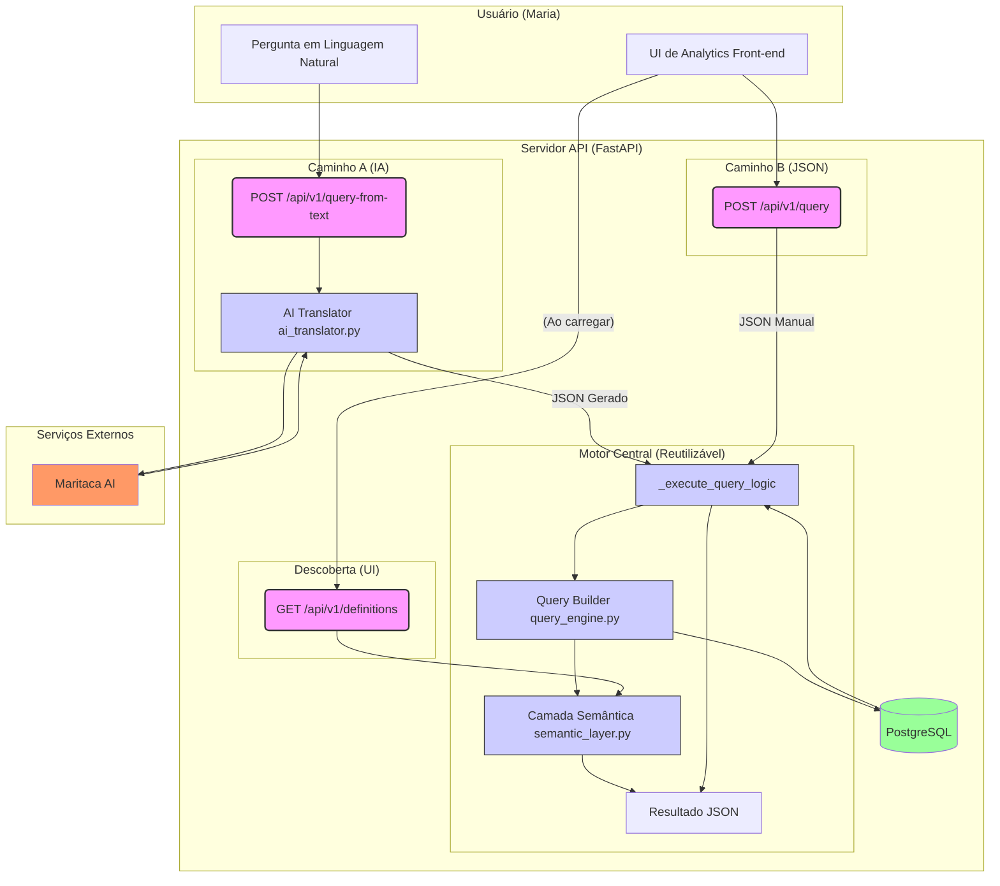

## Documentação de Arquitetura: Analytics Query Builder (Backend)

### 1\. A Solução do Problema (A Dor da "Maria")

-----

Nosso desafio central era resolver a dor da "Maria", dona de um restaurante que, como muitos empreendedores, estava "rica em dados, mas pobre em insights".

Ela possuía um volume imenso de dados, mas não conseguia responder perguntas de negócio essenciais ("Qual produto vende mais na quinta à noite no iFood?"). As ferramentas existentes ou eram rígidas demais (dashboards fixos) ou complexas demais (exigindo um especialista em Power BI).

Nossa solução ataca essa dor com dois pilares, focando em **exploração livre** e **facilidade de uso**:

1.  **Exploração Livre (O "Query Builder"):** O endpoint `POST /api/v1/query` é o coração da ferramenta. Ele permite que um front-end (como uma Tabela Dinâmica) envie um JSON estruturado com métricas, dimensões e filtros. Isso permite que a Maria *crie suas próprias visões* sem depender de desenvolvedores, resolvendo a dor da inflexibilidade.

2.  **Facilidade de Uso (O "Tradutor de IA"):** O endpoint `POST /api/v1/query-from-text` resolve a dor da complexidade técnica. A Maria não precisa aprender a usar uma interface; ela pode simplesmente *perguntar* o que quer saber (ex: "top 5 produtos no delivery este mês").

Ao focar em **insights acionáveis** (como cruzar `ticket_medio` com `bairro_entrega`) em vez de apenas **mostrar números**, esta arquitetura capacita a Maria a tomar decisões reais sobre estoque, marketing e operações.

### 2\. Visão Geral da Arquitetura

-----

Esta seção detalha o *como* construímos o sistema, por que escolhemos certas tecnologias e quais trade-offs foram feitos.

#### 2.1. Diagrama de Fluxo de Dados

O diagrama abaixo ilustra os dois principais caminhos que um dado pode percorrer no nosso sistema:

1.  **Caminho A (Linguagem Natural):** A "Maria" pergunta, a IA traduz, nosso motor executa.
2.  **Caminho B (Query JSON):** Uma interface (o front-end) envia um JSON estruturado, nosso motor executa.

<!-- end list -->



#### 2.2. O Contrato da API: O Diálogo JSON

Para que o "Caminho B" funcione, o front-end e o back-end precisam "falar a mesma língua". Este é o contrato de I/O (Input/Output) da API, que permite ao front-end descrever de forma declarativa a consulta que o usuário deseja.

**O "Pedido" (Request Body)**

O front-end não envia SQL. Ele envia um "pedido" estruturado em JSON que descreve *o que* o usuário quer ver. Este JSON é a linguagem da nossa Camada Semântica.

Por exemplo, para a pergunta "Quais os 3 produtos mais vendidos no iFood?", o front-end montaria o seguinte JSON:

```json
{
  "metrics": ["total_vendas"],
  "dimensions": ["produto_nome"],
  "filters": [
    {"field": "canal_nome", "operator": "eq", "value": "iFood"}
  ],
  "order_by": [
    {"field": "total_vendas", "direction": "desc"}
  ],
  "limit": 3
}
```

**A "Entrega" (API Response)**

O back-end recebe esse "pedido", usa o `QueryBuilder` para traduzi-lo em SQL otimizado, executa a consulta e devolve uma resposta completa:

```json
{
  "query_sql": "SELECT SUM(sales.total_amount) AS \"total_vendas\", ...",
  "data": [
    {
      "total_vendas": "1019062.85",
      "produto_nome": "X-Burger G #042"
    },
    ...
  ],
  "execution_time_ms": 137.45650299824774
}
```

A resposta é desenhada para ser completa:

  * **`query_sql`**: Fornece transparência total e facilita o debug.
  * **`data`**: A "resposta" em si, formatada em JSON.
  * **`execution_time_ms`**: O "selo de performance", provando o cumprimento do RNF.

#### 2.3. Decisões de Engenharia (Os "Porquês" e os "Trade-offs")

Uma arquitetura robusta não é feita apenas de tecnologia, mas de decisões conscientes.

**Escolha 1: Stack Assíncrona (FastAPI + Asyncpg)**

  * **A Escolha:** Usar FastAPI com `asyncpg`.
  * **O Porquê (Performance):** Uma API de analytics é limitada por I/O (espera pelo banco). `asyncpg` é um dos drivers PostgreSQL mais rápidos, e o FastAPI nos deu a validação de dados via Pydantic "de brinde".
  * **O Trade-off (Complexidade):** Código `async/await` é ligeiramente mais complexo. **Aceitamos** essa complexidade em troca de performance.

**Escolha 2: Um "Tradutor Semântico" Customizado (vs. um ORM)**

  * **A Escolha:** Construir um motor `QueryBuilder` customizado em vez de usar um ORM (como SQLAlchemy).
  * **O Porquê (Controle Total):**
    1.  **Performance:** ORMs são fantásticos para CRUD, mas ineficientes para `GROUP BY` e `JOIN` complexos de analytics. Nosso Builder nos dá **controle total sobre o SQL gerado**.
    2.  **Manutenibilidade (SOLID):** O `QueryBuilder` obedece ao Princípio Aberto/Fechado. Podemos adicionar novas métricas no `semantic_layer.py` **sem jamais alterar a lógica do motor**.
  * **O Trade-off (Esforço Inicial):** Tivemos que escrever mais código "boilerplate". **Aceitamos** esse esforço para garantir performance e manutenibilidade.

**Escolha 3: IA como Geradora de JSON (e não de SQL)**

  * **A Escolha:** Usar a IA para traduzir texto-para-JSON, e não texto-para-SQL.
  * **O Porquê (Segurança):** Esta é a decisão de segurança mais importante do projeto. Modelos de IA "alucinam" e são vulneráveis a "Prompt Injection". **Nunca se deve confiar em uma IA para gerar e executar SQL diretamente**. Nossa arquitetura cria uma **barreira de segurança (AI Guardrail)**:
    1.  A IA gera um JSON.
    2.  Esse JSON é *validado* rigorosamente pelo Pydantic.
    3.  Se a IA alucinar (ex: inventar uma métrica), o Pydantic falha.
    4.  Somente um JSON válido é passado ao nosso `QueryBuilder`.
  * **O Trade-off (Latência da IA):** É um processo de duas etapas (Texto -\> JSON -\> SQL). **Decidimos que a segurança absoluta** supera a pequena latência inicial.


### 3\. Performance e Escalabilidade

-----

  * **A Caça ao Gargalo (De 1.4s para 340ms):**

      * **O Problema:** Nosso teste de performance (`pytest -m performance`) falhou, com a query demorando **1470.83 ms**.
      * **O Diagnóstico:** O PostgreSQL estava fazendo "Full Table Scans".
      * **A Solução:** Adicionamos **Índices B-tree** nas colunas-chave usadas em `JOINs` (ex: `sales.channel_id`) e `WHEREs` (ex: `sales.created_at`).
      * **O Resultado:** O mesmo teste passou com **\~340ms**, provando que o RNF foi atingido.

  * **Prevenindo "Queries da Morte":**
    Implementamos **Validação de Limites** diretamente nos schemas Pydantic (`schemas.py`) para barrar queries excessivamente grandes (ex: `limit: 100000`) antes que elas cheguem ao banco.


### 4\. Qualidade e Metodologia

-----

  * **Qualidade de Código (SOLID e DRY):**

      * **Princípio Aberto/Fechado (SOLID):** A arquitetura `QueryBuilder` + `SemanticLayer` é nosso melhor exemplo.
      * **Don't Repeat Yourself (DRY):** A lógica central (`_execute_query_logic`) é refatorada e reutilizada pelos dois endpoints principais (`/query` e `/query-from-text`).

  * **Testes Automatizados (A Rede de Segurança):**
    Possuímos três camadas de testes:

    1.  **Unitários:** Validam a lógica de tradução (JSON -\> SQL) em isolamento.
    2.  **Integração:** Validam o fluxo da API (HTTP -\> Lógica) com um banco mockado.
    3.  **Performance:** Validam o RNF (\< 500ms) contra o banco de dados real.

  * **Metodologia (TDD de Performance):**
    Usamos os testes para *provar* o problema (a falha de `1470ms`), aplicar a solução (índices) e *provar* a correção (o passe de `340ms`).

### 5\. Referência da API (Endpoints)

-----

Aqui detalhamos o contrato técnico de cada endpoint disponível no backend.

#### `GET /`

  * **Propósito:** Endpoint de "health check" (verificação de saúde).
  * **Uso:** Usado por sistemas de monitoramento (como um Load Balancer) para garantir que a API está online e pronta para receber tráfego.
  * **Response (`200 OK`)**
    ```json
    {
      "status": "ok",
      "message": "Analytics API está no ar!"
    }
    ```

#### `GET /api/v1/definitions`

  * **Propósito:** Retorna o "cardápio" de métricas e dimensões disponíveis.
  * **Uso:** Consumido pelo front-end ao carregar a página. É assim que a UI sabe quais opções deve exibir para o usuário nos seletores.
  * **Response (`200 OK`)**
    ```json
    {
      "metrics": {
        "total_vendas": {
          "sql": "SUM(sales.total_amount)",
          "label": "Total de Vendas (Líquido)",
          "type": "currency",
          "joins_needed": []
        },
        "...": "..."
      },
      "dimensions": {
        "data_venda": {
          "sql": "DATE_TRUNC('day', sales.created_at)",
          "label": "Data da Venda",
          "type": "time",
          "joins_needed": []
        },
        "...": "..."
      }
    }
    ```

#### `POST /api/v1/query`

  * **Propósito:** O principal endpoint de consulta baseado em JSON ("Caminho B").
  * **Uso:** Recebe um "pedido" estruturado do front-end (conforme descrito na Seção 2.2) e o executa.
  * **Request Body**
    ```json
    {
      "metrics": ["total_vendas"],
      "dimensions": ["produto_nome"],
      "filters": [
        {"field": "canal_nome", "operator": "eq", "value": "iFood"}
      ],
      "order_by": [
        {"field": "total_vendas", "direction": "desc"}
      ],
      "limit": 1000
    }
    ```
  * **Response (`200 OK`)**
    ```json
    {
      "query_sql": "SELECT SUM(sales.total_amount) AS \"total_vendas\", products.name AS \"produto_nome\"\nFROM sales\nLEFT JOIN channels ON sales.channel_id = channels.id\nJOIN product_sales ON sales.id = product_sales.sale_id\nJOIN products ON product_sales.product_id = products.id\nWHERE channels.name = $1\nGROUP BY products.name\nORDER BY \"total_vendas\" DESC\nLIMIT 3",
      "data": [
        {
          "total_vendas": "1092962.80",
          "produto_nome": "Combo Duplo M #014"
        },
        {
          "total_vendas": "1010216.34",
          "produto_nome": "Lasanha P #019"
        },
        {
          "total_vendas": "997201.17",
          "produto_nome": "Cerveja G #081"
        }
      ],
      "execution_time_ms": 122.39968499488896
    }
    ```

#### `POST /api/v1/query-from-text`

  * **Propósito:** O endpoint de consulta baseado em linguagem natural ("Caminho A").
  * **Uso:** Recebe uma pergunta do usuário, traduz para JSON usando IA e, em seguida, executa a consulta reutilizando a mesma lógica do `/api/v1/query`.
  * **Request Body**
    ```json
    {
      "prompt": "Quero saber os 3 produtos mais vendidos no iFood"
    }
    ```
  * **Response (`200 OK`)**
    ```json
    {
      "query_sql": "SELECT SUM(sales.total_amount) AS \"total_vendas\", products.name AS \"produto_nome\"\nFROM sales\nLEFT JOIN channels ON sales.channel_id = channels.id\nJOIN product_sales ON sales.id = product_sales.sale_id\nJOIN products ON product_sales.product_id = products.id\nWHERE channels.name = $1\nGROUP BY products.name\nORDER BY \"total_vendas\" DESC\nLIMIT 3",
      "data": [
        {
          "total_vendas": "1092962.80",
          "produto_nome": "Combo Duplo M #014"
        },
        {
          "total_vendas": "1010216.34",
          "produto_nome": "Lasanha P #019"
        },
        {
          "total_vendas": "997201.17",
          "produto_nome": "Cerveja G #081"
        }
      ],
      "execution_time_ms": 122.39968499488896
    }
    ```