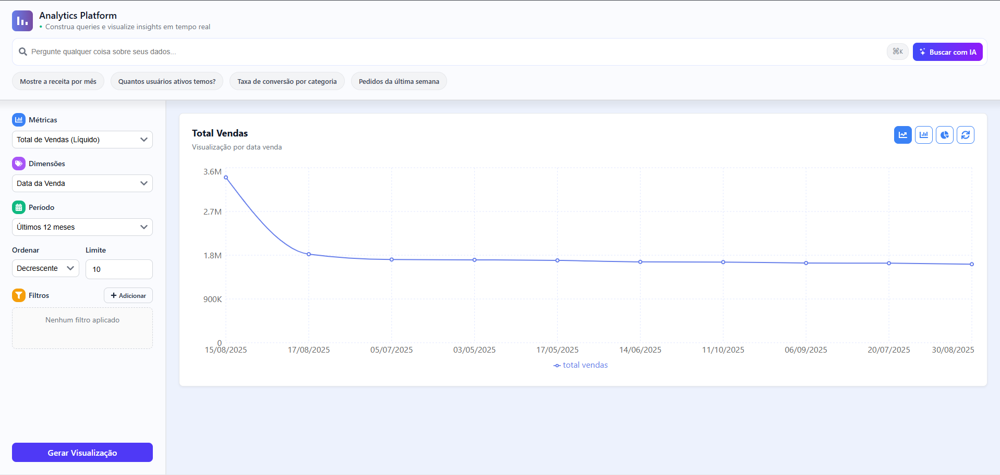

## Documentação de Arquitetura: Analytics QueryBuilder (Frontend)

### 1\. A Solução do Problema (O "Volante" da Maria)

-----
Se o backend é o "motor" do nosso Query Builder, este projeto é a interface (UI) — o "volante" que coloca o poder nas mãos da "Maria".

O objetivo deste front-end é traduzir a complexidade de métricas, dimensões e filtros em uma experiência de usuário limpa e intuitiva. É a ferramenta que permite à "Maria" construir suas próprias análises, aplicar filtros avançados e, o mais importante, *visualizar* os dados de forma dinâmica, sem depender de ninguém.

Construído com React e Vite, ele consome a API do backend (FastAPI) e transforma JSONs em insights acionáveis.


### 2\. Visão Geral da Arquitetura

-----
Aqui detalhamos *o que* a interface faz e *como* ela foi organizada para entregar uma experiência fluida e de fácil manutenção.

#### 2.1. O que a Interface Permite Fazer

  * **Construir Queries Visualmente:** Uma interface intuitiva para selecionar múltiplas métricas e dimensões.
  * **Filtrar de Forma Avançada:** Permite ao usuário adicionar múltiplos filtros complexos *antes* de executar a consulta, economizando tempo e processamento.
  * **Visualizar Dinamicamente:** Renderiza os dados em múltiplos formatos (Barra, Linha, Pizza, Tabela) usando `recharts`.
  * **Perguntar em vez de Clicar:** Uma barra de busca com IA permite que a "Maria" faça perguntas em linguagem natural (ex: "Qual a receita do último mês?").
  * **Gerenciamento de Estado Centralizado:** O estado da query, filtros e dados é gerenciado de forma global com `zustand`, garantindo que toda a aplicação esteja sempre sincronizada.
  * **Design Responsivo:** O layout se adapta para uso em desktop ou dispositivos móveis.

#### 2.2. O que Usamos (Stack Tecnológica)

  * **Biblioteca UI:** React 18+
  * **Build Tool:** Vite
  * **Gerenciamento de Estado:** Zustand
  * **Cliente HTTP (API):** Axios
  * **Visualização de Dados:** Recharts
  * **Ícones:** React Icons
  * **Linguagem:** TypeScript

#### 2.3. Como nos Organizamos (Estrutura do Projeto)

A arquitetura do projeto foi pensada para ser limpa e escalável, onde cada arquivo tem um propósito claro:

```
/src
├── /components/      # Componentes de layout (Header, QueryBuilder, Visualization)
│   ├── /ui/          # Componentes de UI puros e reutilizáveis (MultiSelectDropdown, FilterPill)
│   └── AddFilterModal.tsx
│   └── AiSearchBar.tsx
│   └── ...
│
├── /config/          # Constantes de configuração (opções de dropdown, cores)
│   └── chartConstants.ts
│
├── /hooks/           # Custom Hooks para lógica de UI complexa e reutilizável
│   └── useChartFormatters.ts  # Centraliza a lógica de formatação de dados
│
├── /services/        # Módulos de comunicação com o exterior (APIs)
│   └── apiService.ts          # Centraliza todas as chamadas Axios para o backend
│
├── /store/           # Gerenciamento de estado global (o "cérebro")
│   └── useQueryStore.ts       # Store do Zustand que controla a query e os resultados
│
├── /utils/           # Funções puras e utilitárias (sem estado)
│   └── errorUtils.ts          # Helper para tratar e formatar erros da API
│   └── formatters.ts          # Helpers de formatação (moeda, data, etc.)
│
├── App.css           # Estilos do layout principal (Grid, responsividade)
├── App.tsx           # Componente raiz, define o layout
├── main.tsx          # Ponto de entrada da aplicação
└── index.css         # Estilos globais (reset, fontes)
```


### 3\. Decisões de Engenharia (Os "Porquês" e os "Trade-offs")

-----
Esta seção detalha o "porquê" das nossas escolhas tecnológicas para o front-end.

**Escolha 1: React para Consumir a API**

  * **O Porquê (Componentização):** A natureza da nossa aplicação é um *dashboard* complexo, composto por muitos "widgets" (Header, filtros, gráfico, tabela). O modelo de componentização do React é perfeito para isolar, reutilizar e gerenciar a lógica de cada pedaço da tela.
  * **O Porquê (Ecossistema):** Para uma aplicação de *Analytics*, bibliotecas de gráficos são essenciais. O React possui o ecossistema mais vasto, com soluções robustas como a `recharts`, que usamos extensivamente.
  * **O Porquê (Reatividade):** O *core* da aplicação é: "Quando os *inputs* (Dropdowns) mudam, a *saída* (Gráfico) deve mudar". O modelo reativo do React, combinado com o `zustand`, torna essa sincronização de estado trivial.

**Escolha 2: Vite em vez de Create React App (CRA)**

  * **O Porquê (Performance de Dev):** Vite usa o sistema de módulos ES nativo do navegador. Na prática, isso significa um tempo de inicialização e Hot Module Replacement (HMR) quase **instantâneos**. O CRA (Webpack) precisa *bundar* toda a aplicação antes de iniciar, o que é muito mais lento.
  * **O Porquê (Build Otimizado):** Vite usa Rollup para o *build* de produção, gerando *bundles* menores e mais eficientes.
  * **O Trade-off (Nenhum):** Honestamente, não há trade-off. Vite é o padrão-ouro atual para novos projetos React. Foi uma escolha puramente técnica pela melhor ferramenta.

**Escolha 3: Node/Vite em vez de Bun (A Escolha de 2025)**

  * **O Porquê (Estabilidade vs. Hype):** Bun é uma *toolchain* "all-in-one" incrivelmente rápida. No entanto, no contexto deste projeto, o ecossistema **Vite + Node.js** é vastamente mais **maduro, estável e testado em produção**.
  * **O Trade-off:** A escolha foi prezar pela **confiabilidade e estabilidade** do Vite em detrimento da velocidade de *build* (ainda em maturação) do Bun. Para um projeto profissional, a estabilidade é mais importante.

**Escolha 4: Zustand em vez de Redux**

  * **O Porquê (Simplicidade):** Zustand foi escolhido por evitar o *boilerplate* (actions, reducers, dispatchers) do Redux. Ele funciona como um simples hook e resolve nosso problema de estado global.
  * **O Trade-off:** Em um projeto gigantesco com centenas de ações, a estrutura opinativa do Redux Toolkit poderia facilitar a depuração.
  * **A Decisão:** Para a escala deste projeto, **Zustand é a ferramenta ideal**: entrega todo o poder de um estado global sem o custo da complexidade.

### 4\. Qualidade e Metodologia

-----

A estrutura do projeto (vista na Seção 2.3) não é acidental. Ela é o resultado direto da aplicação de princípios de qualidade de software:

  * **Princípio da Responsabilidade Única (SRP):** Cada parte do sistema tem uma única responsabilidade.

      * **Stores (`zustand`)** cuidam APENAS do estado.
      * **Services (`axios`)** cuidam APENAS da rede.
      * **Hooks (`useChartFormatters`)** cuidam APENAS da lógica de UI complexa.
      * **Componentes** cuidam APENAS da renderização (UI).

  * **Don't Repeat Yourself (DRY):** Lógicas reutilizáveis são abstraídas. Funções puras de formatação vão para `/utils`, lógicas de UI com estado vão para `/hooks`, e componentes visuais puros vão para `/components/ui`.

  * **O Benefício (Manutenibilidade):** Essa separação torna a vida muito mais fácil. É simples testar o `useQueryStore` "mockando" o `apiService`. É fácil trocar o `axios` pelo `fetch` (só precisamos mudar 1 arquivo). É fácil adicionar um novo formatador (só mexer em `formatters.ts` e `useChartFormatters.ts`).


### 5\. Referência: A Interface em Ação

-----
